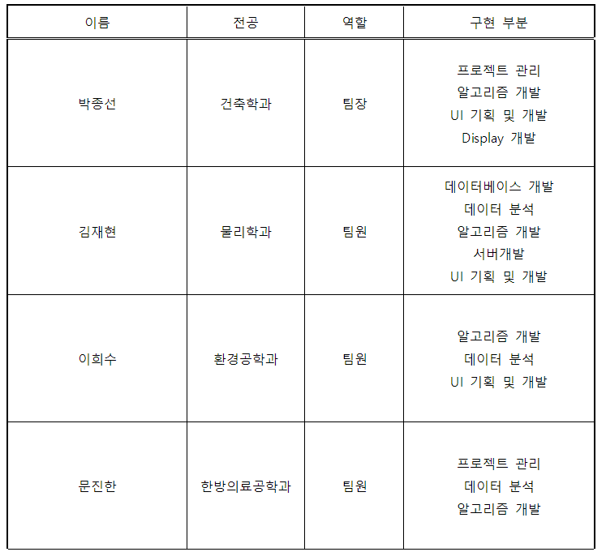
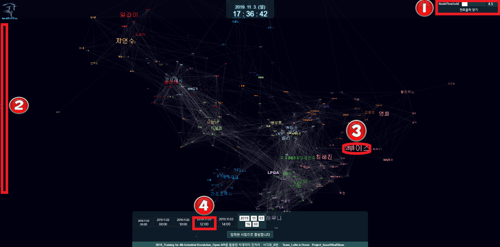
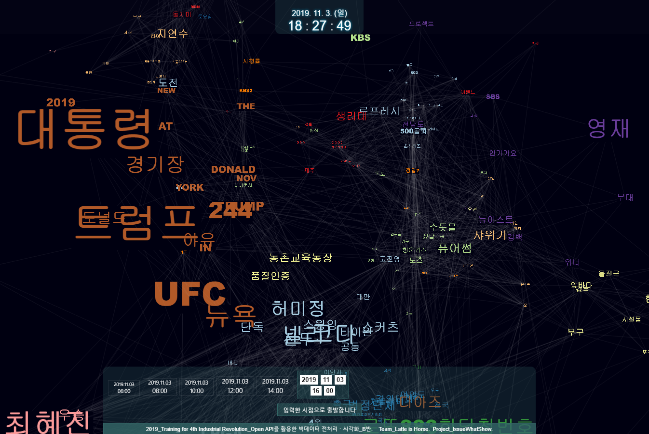
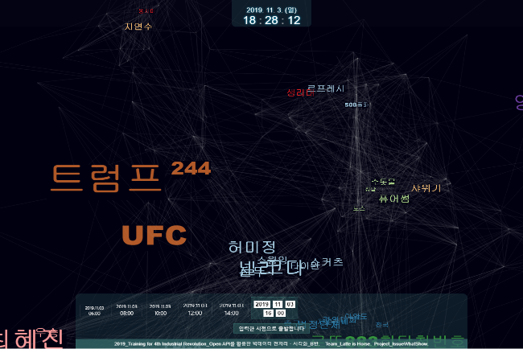
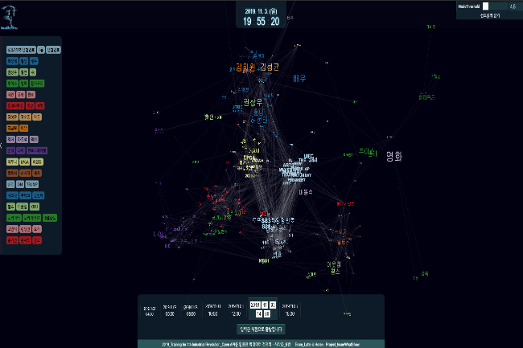
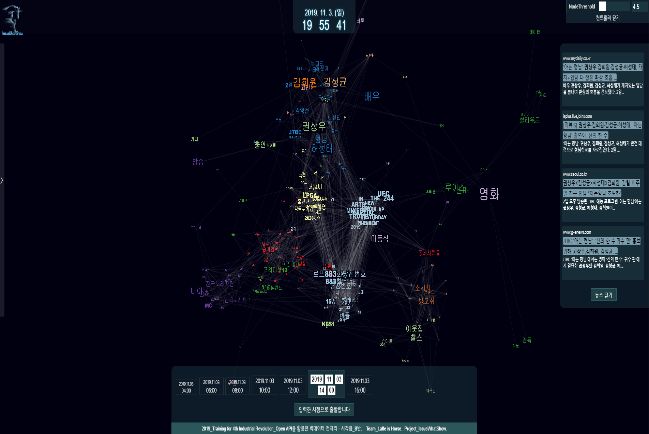
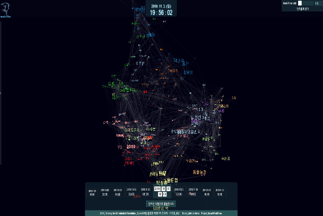
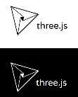

# IssueWhatShow
## 1. 프로젝트 개요 

1.1 프로젝트 기획 배경 및 목표 

Open API 다양한 검색어, 키워드가 급상승하고, 급락 한다. 검색어를 보는 입장에서 알 수 있는 정보는 이 정보가 핫 검색어라는 사실 하나이다. 여기에 이제까진 교육과정에서 배운 내용을 토대로  검색어의 중요성, 맥락, 연관성을 분석하고 이를 시각화 한다. 
목표는  첫번째 , 급상승 검색어를 가장 대표적인 4개의 웹사이트의 실시간 검색어를  실시간 현황을 통해 가져오고, 두번째 ,   실시간 검색어 키워드의 중요성과  키워들 간의 연관성을 어떻게 분석 할 것인가에 대한 분석 방법 토론 , 세번째 , 이를 어떻게 시각화 할 것인가 , 네번째 이를 구현하는 것이다. 

1.2 구성원 및 역할

## 2. 프로젝트 현황

- 현재 제공 되는 사이트는 주요 사이트의 핵심 키워드를 통해 검색어 끼리의 연관분석을 통해  통합적인 현 우리나라의 관심 현황을  3d-graph 시각화 라이브러리를 통해 보여주어 이용자가 트렌트 검색어 현황을 한 눈에 파악 하기 쉽다. 
  대형사이트 다음과 네이버의 실시간 검색어를 가져오고 이를 통해 뉴스 검색을 하여 현 우리나라의 전체적인 관심현황을 가져오고 이를 한눈에 볼 수 있도록 시각화 한다.
  각 검색어를 클릭시 해당 검색어 관련 뉴스를 볼 수 있는 기능 추가를 하여 이슈 파악이 용이하다. 
   2시간의 텀을 두고 검색어를 가져오고, 분석하기 때문에 2시간 단위로 각 시간때의 핫 검색어를 파악 하기 쉽다. 
  이런 다양한 기능을 통해 종합적인 우리나라의 핫이슈 현황 파악을 시각화 한 것이 핵심 기술이다.

## 3. 프로젝트 개발 결과

- 홈 화면은 전체적인 검색어가 노드화 되어 링크로 연결된 모양이다.(검색어는 글자로, 각 검색어는 거미줄처럼 연관되어 링크로 연관도 확인 할수 있다.) 상단 왼쪽은 팀 마크, 상단 중앙 현 시간 표현, 상단 오른쪽 각 검색어 노드 개수 지정 , 중앙 다양한 검색어 를 연관도와 함께 표시, 중앙 왼쪽 검색어 표시란, 중앙 아래 시간 별 검색어를 볼 수 있는 기능이 있다.

 

 노드 개수 조절

- 노드 컨트롤러 를 크게 할 수록 검색어 순위가 낮은(연관도가 낮은) 검색어 들이 사라지게 된다. 자유롭게 조절 가능하며 기본 값은 4.5로 이 값보다 커지면 검색어 순위가 높은 검색어만 남고4.5보다 낮으면 검색어 순위가 낮은 검색어도 보이게 된다.

 검색어를 한 눈에

- 왼쪽의 화살표 버튼 클릭시 숨어있던 테이블이 나타나며  실시간 대표 검색어가 첫번째 행에 표시가 되고 각 검색어의 연관  검색어 2가지가 연결되어 테이블의 형식으로 확인할 수 있다.
- 테이블에 표시된 검색어 클릭시 본문에 있는 해당 검색어를 가진  노드가 중앙으로 확대되어 나타난다. 

 검색어 관련 뉴스 제공

-  기본 화면에 존재하는 다양한 노드클릭하면 해당 노드에 들어있는 검색어를 네이버 api를 통해 뉴스를 검색해 와 이를 4개까지 간략하게 뉴스 제목과 뉴스 내용을 확인 할 수 있다.

 시간에 따른 검색어 제공

-  아랫쪽 하단에 시간 순서를 확인 할 수 있고 해당 시간으로 이동하면 시간여행을 하듯 그 시간때의 주요 검색어를 확인 할 수 있다. 하얀색 빈칸에 원하는 시간대를 작성 후 입력한 시점으로 이동 버튼을 클릭하면 해당 시간대와 가장 가까운 시간대로 이동하게 된다. 

#### 3.2 사용 기술 및 인프라 구축

도에인 주소는 [http://www.issuewhatshow.com](http://www.issuewhatshow.com) 

